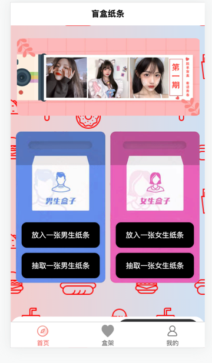
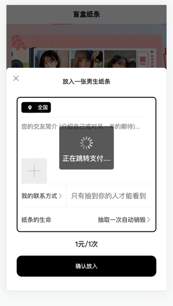
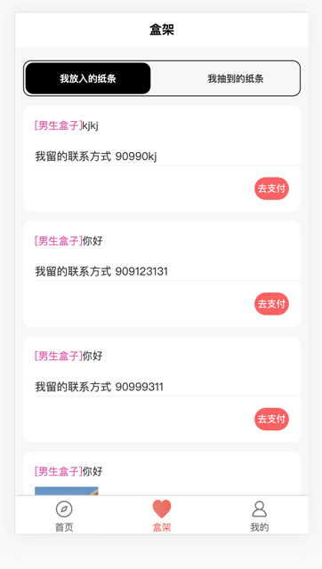
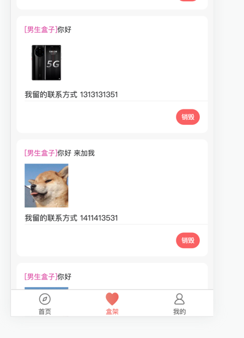
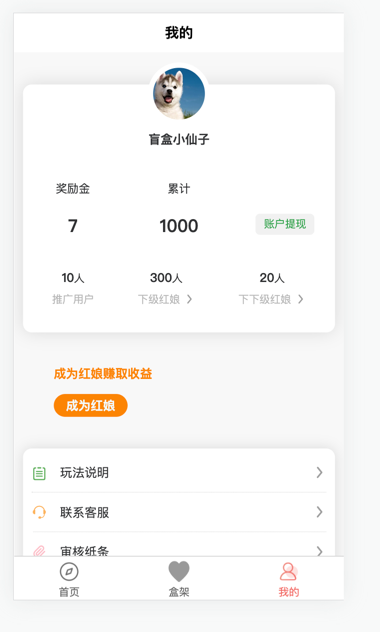

# blind_box
项目名: 交友盲盒

项目状态: 开发中(支付平台api接口异常)

开发周期: 30天

技术栈: java(后端接口),php+tp5(后台管理系统),SSM(spring+springboot+mybatis),Maven,Redis,Rabbitmq

简介: 前端页面借用了dcloud插件市场的模版(https://ext.dcloud.net.cn/plugin?id=7205),整体实现思路很简单模仿了摆地摊抽盲盒的思路,
主要就是纸条的抽取和纸条的投放,整体项目的核心内容就是用户的支付(易支付平台)和用户抽取的匹配机制

描述: 项目目前还在开发支付模块的功能,支付采用第四方支付平台(易支付)用户投放一张纸条加入Rabbitmq队列中保存订单到mysql中去,同时把订单编号,订单超时时间异步加入到待支付队列中等待用户支付
,用户支付了生产者发送订单信息给Rabbitmq,消费者拿到订单信息去修改数据库状态,用户没有支付并且消息过期了就会触发消息过期策略去修改订单状态为取消,
匹配机制采用随机百分百概率匹配使用Redis去缓存男女两种性别的纸条池,每个纸条有两种情况,一种是抽取一次就销毁,另一种是不销毁,抽取到第一种即每次判断状态然后修改掉数据库的状态然后然后重新查询出数据放入到纸条池里面
支付方式成功返回用户纸条信息,超时或退出支付页面视为订单取消就直接消费掉消息

